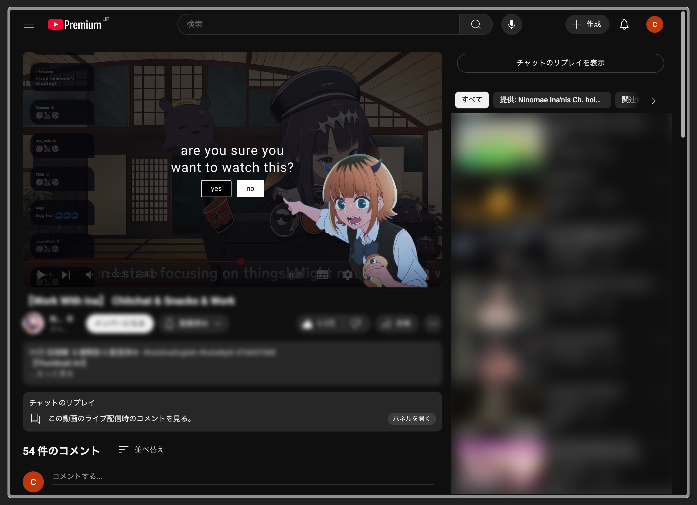

# 「INTENTION」
a chrome extension designed to help you be more intentional about your online content consumption habits...

# how it works
- when you open a youtube video, a message will pop up asking if you are sure you want to watch the video.
- clicking 'yes' increases the count by one.
- clicking 'no' closes the tab.
- once you reach your maximum video count, you will no longer be able to access the website until the count decreases.
- if you click 'yes' on the last video, all other tabs that are open and haven't been clicked 'yes' on will be blocked.

# settings
- change your maximum video count
- adjust how quickly your count resets
- view your current video count

# why it works...?
sure, it is easy to increase the limit of videos you can watch, reduce the time it takes for them to come back, or just turn off the extension, but that is not the point... the brief pause before watching content helps you ask:

> "*do* i really want to watch this?"

which i think is valuable enough to change your habits over time :D

# installation
1. download the zip file from the github repository
2. unzip the file
3. go to chrome://extensions/
4. turn on developer mode
5. click 'load unpacked'
6. select the folder that you unzipped

## HELP
PLEASE LEAVE FEEDBACK ON HOW I CAN IMPROVE THE CODE. I KNOW THAT IT IS TERRIBLE AND I REALLY WANT IT TO BE BETTER!
