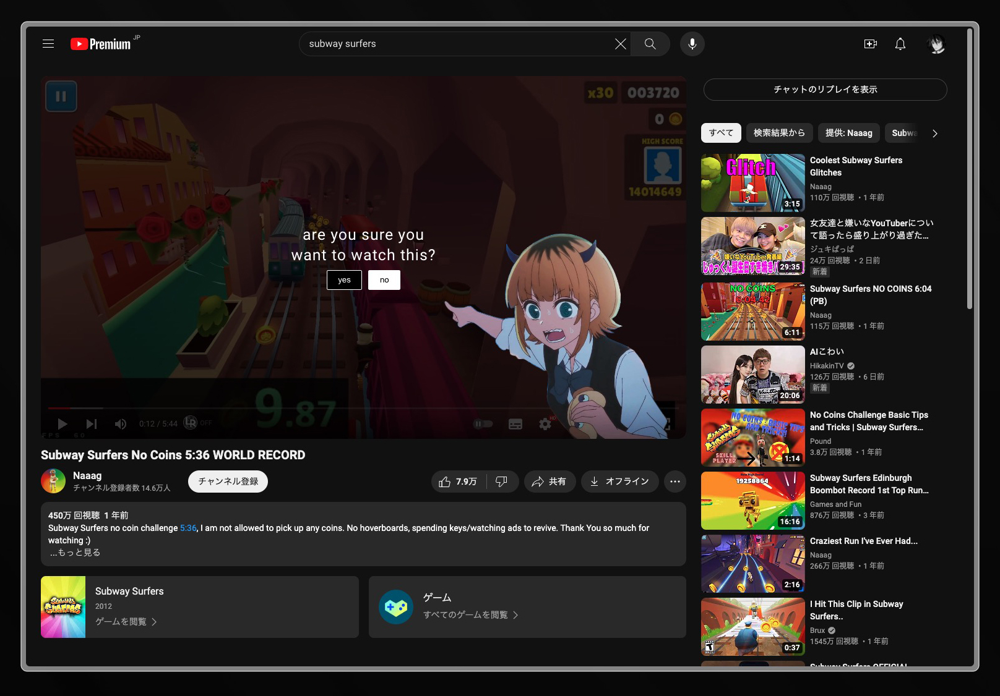

# INTENTION
The Intention browser extension is designed to help users become more intentional in their online content consumption habits. Its primary purpose is to encourage the consumption of longer-form content over shorter, potentially more distracting content.It acts as a way to check in with yourself, prompting you to actually use your brain every time a new video is clicked, and helping to break free from the infinite cycle of mindlessly consuming content without conscious awareness.

- pressing yes adds one to the count.
- pressing no closes the current tab.
- if you reach the max count you can no longer access the website until the count is reduced.
- if you click yes on the last video, all other tabs that are open and haven't been clicked 'yes' on will be blocked.
- you can change the max videos you can watch and the rate at which the count decreases in the extension popup.

sure, it is easy to increase the limit of videos you can watch, reduce the time it takes for them to come back, or just turn off the extension, but that is not the point. if you installed this extension, I know was is a reason for it. you WANT to stop mindlessly consuming so much content. if you increase the limit of videos you can watch, the message that comes up before the video plays still helps you to take a moment to think "*do* I really want to watch this?" which I think is very valuable. 

## HELP
PLEASE LEAVE FEEDBACK ON HOW I CAN IMPROVE THE CODE. I KNOW THAT IT IS TERRIBLE AND I REALLY WANT POINTERS.
